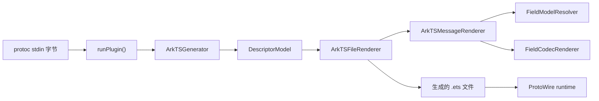

# 架构说明

## 设计目标

生成器采用“职责类 + 纯函数”的混合结构。存在生命周期、上下文或编排职责的部分使用类；命名、模板拼接、参数解析、协议编解码和标量映射继续使用纯函数。

## 生成流水线

| 组件                   | 单一职责                                           |
| ---------------------- | -------------------------------------------------- |
| `runPlugin()`          | 解码 protoc request、编码 response、统一错误兜底   |
| `ArkTSGenerator`       | 参数解析、模型创建、目标排序和逐文件生成           |
| `DescriptorModel`      | 一次建立并校验文件表、符号表和输出名               |
| `ArkTSFileRenderer`    | 规划单文件 import，渲染 enum 与 message            |
| `ArkTSMessageRenderer` | 组装一个 message 的字段、编解码和辅助方法          |
| `FieldModelResolver`   | 把 descriptor 字段转换为已校验的语义模型           |
| `FieldCodecRenderer`   | 生成 singular、repeated、packed、map、oneof codec  |
| `ProtoWire`            | 在 ArkTS 侧实现 wire reader、writer 与容器辅助函数 |

## 建模与诊断

`DescriptorModel` 在渲染前关闭文件和符号级错误，包括重复文件、重复符号、扁平 ArkTS 名称冲突、输出文件冲突、缺失生成目标和非 proto3 输入。

`FieldModelResolver` 只向渲染器暴露只读判别联合，普通字段和 map 字段不共享可选属性。
它负责字段号、oneof index、map entry、map key、类型解析、group 与 proto3 optional 校验。
错误继续写入 `CodeGeneratorResponse.error`，不会污染 stdout 的 protoc 字节协议。

## 扩展入口

- `renderSource` 是生成源码专用的模板标签：它去除模板公共缩进，并让多行插值继承占位符缩进。
  它只改善生成器源码的可读性，不参与 Protobuf 语义判断。
- 新增标量行为：先修改 `scalar-shapes.ts`，再补字段模型与 codec 测试。
- 新增字段语义：从 `FieldModelResolver` 建模，避免渲染阶段扫描原始 descriptor。
- 新增文件级声明：在 `ArkTSFileRenderer` 中规划 import 与输出顺序。
- 新增 wire 能力：在 `runtime/ProtoWire.ets` 中实现，并补 HarmonyOS 单元测试。
- service/rpc：新建独立 protoc 插件，不扩张 message renderer。

## 确定性与兼容性

目标文件、符号和诊断中的集合都按稳定顺序处理。`generator/test` 对代表性 fixture 保存生成源码 SHA-256，确保内部重构不会悄悄改变已发布的合法输出。
提交前应手动重新生成仓库中的基础示例，并通过 `git diff` 校验。
